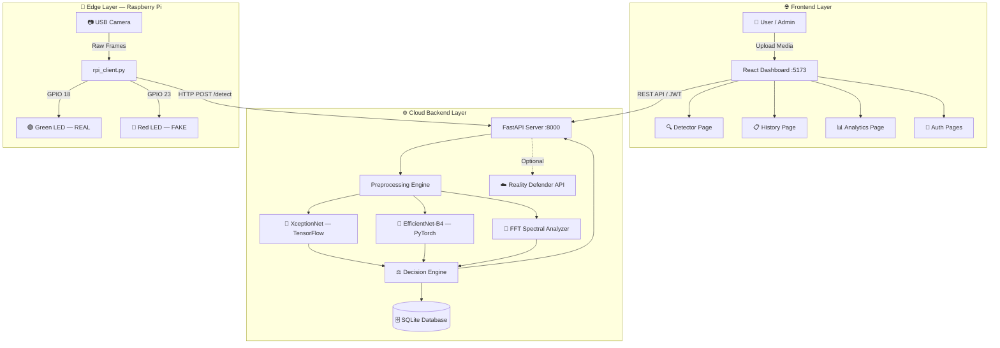

<div align="center">


<br/>

<p>
  
  
  
  
  
  
  
</p>

<p>
  
  
  
  
</p>

<br/>

> **"In a world where seeing is no longer believing, we build the tools to tell truth from fiction."**

<br/>

An end-to-end **Hybrid Edge-Cloud platform** for detecting face-swap deepfakes across **images, video, and audio** — powered by dual deep learning architectures, spectral frequency analysis, and real-time IoT hardware feedback.

<br/>

</div>

---

## 📌 Table of Contents

<details>
<summary><b>Click to expand</b></summary>

- [🌍 Why This Project Exists](#-why-this-project-exists)
- [🔍 About the Project](#-about-the-project)
- [❗ Problem Statement](#-problem-statement)
- [💡 Our Solution](#-our-solution)
- [🏗️ System Architecture](#️-system-architecture)
- [🔄 End-to-End Data Flow](#-end-to-end-data-flow)
- [🛠️ Tech Stack](#️-tech-stack)
- [🧠 AI Models & Detection Logic](#-ai-models--detection-logic)
- [📐 Mathematical Model](#-mathematical-model)
- [🖥️ Frontend — Web Dashboard](#️-frontend--web-dashboard)
- [⚙️ Backend — API Server](#️-backend--api-server)
- [🔌 Hardware — Edge Device (Raspberry Pi)](#-hardware--edge-device-raspberry-pi)
- [🗄️ Database Schema](#️-database-schema)
- [📁 Project Structure](#-project-structure)
- [🚀 Getting Started](#-getting-started)
- [📡 API Reference](#-api-reference)
- [☁️ Deployment Guide](#️-deployment-guide)
- [🔒 Security Design](#-security-design)
- [🧪 Testing & Diagnostics](#-testing--diagnostics)
- [👥 Team](#-team)
- [🔮 Future Scope](#-future-scope)
- [📄 License](#-license)

</details>

---

## 🌍 Why This Project Exists

The internet is undergoing a silent crisis.

A 30-second video clip of a CEO saying something they never said. A voice note from a family member asking for money. A photograph placed at a scene of a crime. None of it real — all of it alarmingly convincing.

Generative AI has democratized the creation of synthetic media to the point where a single consumer GPU and a few hours of training data are enough to produce a deepfake that can fool human observers. The tools to *create* synthetic media have far outpaced the tools to *detect* it.

**Pinnacle 6** was built to close that gap.

---

## 🔍 About the Project

**Pinnacle 6** is a production-grade, full-stack deepfake detection platform that analyzes **images, videos, and audio** to determine whether content is authentic or synthetically generated. It is designed around three equally important pillars:

| Pillar | Philosophy |
|--------|------------|
| 🎯 **Accuracy** | Dual deep learning models cross-validate every prediction. A single model's bias can be fatal — so we use two. |
| ⚡ **Speed** | Edge-cloud architecture ensures that surveillance scenarios get instant feedback without waiting for cloud round-trips. |
| 🧩 **Accessibility** | Whether you're a researcher, security operator, or curious individual — the system works via a browser, a terminal, or a physical device. |

The platform is intentionally designed as a **research-to-deployment bridge**: it can operate in full simulation mode (no GPU, no pre-trained weights) for rapid prototyping and UI development, then seamlessly switch to production-grade inference when model weights are available.

---

## ❗ Problem Statement

### The Scale of the Threat

Deepfakes are no longer a niche concern — they are a mainstream weapon:

- 🗞️ **Misinformation & Political Manipulation** — Fabricated videos of world leaders making inflammatory statements have already been deployed in active geopolitical conflicts.
- 💸 **Financial Fraud** — Deepfake voice calls impersonating executives have resulted in multi-million dollar wire transfers. In one documented case, a finance worker transferred $25 million after a fake video call with a "CFO."
- 🔐 **Identity Theft** — Face-swap technology is being weaponized to bypass facial recognition systems used in KYC (Know Your Customer) verification at banks and borders.
- 🧒 **Exploitation & Abuse** — Non-consensual synthetic intimate imagery has become a critical online safety problem, particularly targeting minors.
- 🛡️ **National Security** — Intelligence communities globally are grappling with the challenge of authenticating media in high-stakes decision-making environments.

### The Technical Gap

Most detection tools that exist today suffer from one or more of these limitations:

- They are **cloud-only** and cannot provide real-time feedback at physical checkpoints.
- They analyze only **one modality** (e.g., image only, or audio only) — but real attacks use combinations.
- They are **black boxes** with no explanation of *why* content is flagged.
- They require **expensive GPU infrastructure** that isn't accessible to most organizations.

---

## 💡 Our Solution

Pinnacle 6 attacks these limitations directly:

```
┌─────────────────────────────────────────────────────────┐
│                    PINNACLE 6 SOLUTION                   │
├─────────────────┬───────────────────┬───────────────────┤
│   MULTI-MODAL   │   HYBRID COMPUTE  │   EXPLAINABLE     │
│                 │                   │                   │
│  • Images       │  • Cloud backend  │  • Confidence %   │
│  • Videos       │  • Edge IoT node  │  • Reason codes   │
│  • Audio        │  • CPU-compatible │  • FFT heatmaps   │
│  • Live camera  │  • Fallback mode  │  • Variance stats │
└─────────────────┴───────────────────┴───────────────────┘
```

| Challenge | Our Approach |
|-----------|-------------|
| Cloud-only limitations | Raspberry Pi edge client with GPIO LED feedback — instant physical verdict at any checkpoint |
| Single-model fragility | XceptionNet + EfficientNet-B4 dual-model cross-validation with FFT spectral analysis as a third signal |
| Black-box outputs | Every verdict comes with a `reasons` array, spectral energy score, temporal variance, and probability breakdowns |
| GPU dependency | EfficientNet-B4 runs on CPU; demo mode uses deterministic FFT heuristics — no GPU required |
| Single-modality | Unified pipeline handles images, video frames, and audio through modality-specific preprocessing |

---

## 🏗️ System Architecture



### Architectural Decisions Explained

**Why FastAPI?**
FastAPI provides async request handling, automatic OpenAPI documentation, and native Pydantic validation — critical for handling concurrent media uploads from both web users and edge devices without blocking.

**Why SQLite?**
For a single-server academic deployment, SQLite eliminates infrastructure complexity while providing full ACID compliance and zero-configuration setup. The schema is designed to be migrated to PostgreSQL with minimal changes for production scale.

**Why Raspberry Pi?**
The Pi 4 represents the sweet spot between compute capability and cost for physical deployment. Its GPIO interface enables direct hardware control (LEDs, relays, displays) — something cloud-only solutions fundamentally cannot provide.

**Why two models?**
XceptionNet and EfficientNet-B4 have different inductive biases. XceptionNet excels at capturing mesoscopic spatial artifacts; EfficientNet-B4 generalizes better across varying image resolutions and compression levels. Running both and combining their signals reduces false positives significantly.

---

## 🔄 End-to-End Data Flow

### Web Mode (Browser Upload)

```
User selects file
       │
       ▼
React Dashboard encodes as multipart/form-data
       │
       ▼
JWT Bearer token attached to Authorization header
       │
       ▼
POST /detect or /ai-detect  ──────────────────────────────────────────┐
       │                                                               │
       ▼                                                               │
FastAPI receives file → validates MIME type → saves to temp dir        │
       │                                                               │
       ├─ IMAGE ──► Face detection (Haar Cascade)                      │
       │              └─► Crop ROI → Resize → Normalize               │
       │                      └─► XceptionNet (299×299)               │
       │                      └─► EfficientNet-B4 (380×380)           │
       │                      └─► 2D FFT → High-freq energy           │
       │                                                               │
       ├─ VIDEO ──► Frame sampling (configurable interval)             │
       │              └─► Per-frame pipeline (same as IMAGE)           │
       │              └─► Temporal average pooling                     │
       │              └─► Inter-frame variance analysis                │
       │                                                               │
       └─ AUDIO ──► Audio Deepfake API (or hash-based fallback)        │
                                                                       │
                          Decision Engine assembles JSON response ◄────┘
                                   │
                    ┌──────────────┼──────────────┐
                    ▼              ▼              ▼
              Save to DB     Return JSON      Log entry
                    │
                    ▼
           React renders verdict:
           • Animated confidence gauge
           • Synthetic vs. Human likelihood bars
           • Reasons breakdown
           • Confidence band (High / Medium / Low)
```

### Edge Mode (Raspberry Pi)

```
Webcam captures frame every 2 seconds
       │
       ▼
JPEG encoding in memory (no disk I/O)
       │
       ▼
HTTP POST to /detect with frame as file payload
       │
       ▼
Backend processes frame → returns label + confidence
       │
       ├─ REAL ──► GPIO 18 HIGH → Green LED ON (3s) → OFF
       └─ FAKE ──► GPIO 23 HIGH → Red LED ON (3s) → OFF
```

---

## 🛠️ Tech Stack

### 🔵 Backend

| Technology | Version | Role |
|------------|---------|------|
| **Python** | 3.9+ | Core runtime |
| **FastAPI** | 0.100+ | Async REST API framework |
| **Uvicorn** | Latest | ASGI production server |
| **PyTorch** | 2.x | EfficientNet-B4 inference engine |
| **TensorFlow** | 2.x | XceptionNet model training & inference |
| **OpenCV** | 4.x | Haar Cascade face detection, image/video I/O |
| **NumPy** | Latest | Numerical ops, FFT computation |
| **PassLib** | Latest | PBKDF2-SHA256 password hashing |
| **python-jose** | Latest | JWT encoding/decoding |
| **SQLite3** | Built-in | Zero-config persistence layer |
| **Reality Defender SDK** | Latest | Optional commercial detection API |
| **python-dotenv** | Latest | Environment variable management |

### 🟣 Frontend

| Technology | Version | Role |
|------------|---------|------|
| **React** | 18 | Component-based UI framework |
| **Vite** | Latest | Dev server & production bundler |
| **Tailwind CSS** | 3.x | Utility-first styling system |
| **Framer Motion** | Latest | Page transitions & micro-animations |
| **Recharts** | Latest | Analytics data visualization |
| **Axios** | Latest | HTTP client with interceptors |
| **React Router DOM** | 7 | Client-side SPA routing |
| **Lucide React** | Latest | Consistent icon system |
| **Spline** | Latest | Interactive 3D landing page elements |
| **tsParticles** | Latest | Ambient particle background effects |

### 🟠 Hardware / IoT

| Component | Specification | Role |
|-----------|-------------|------|
| **Raspberry Pi 4 Model B** | 4GB RAM | Edge compute node |
| **USB Webcam** | Any V4L2-compatible | Live video capture |
| **Green LED** | 5mm standard | REAL content indicator |
| **Red LED** | 5mm standard | FAKE content indicator |
| **220Ω Resistors** | ×2 | LED current limiting |
| **RPi.GPIO** | Python library | GPIO pin control |

---

## 🧠 AI Models & Detection Logic

### Model 1: XceptionNet — The Spatial Artifact Hunter

**XceptionNet** (Extreme Inception) was originally designed by François Chollet at Google as an evolution of the Inception architecture. Its key innovation — **depthwise separable convolutions** — gives it an exceptional ability to learn cross-channel correlations independently from spatial patterns. This architecture property makes it uniquely effective at capturing **mesoscopic artifacts** in deepfakes: subtle pixel-level inconsistencies that exist at a scale between individual pixels and high-level semantic features.

**What it detects specifically:**

- 🔲 **Face Boundary Artifacts** — When a face is swapped, the boundary between the inserted face and the original background/neck region contains subtle blending artifacts. XceptionNet's depthwise separable layers are particularly sensitive to these boundary transitions.
- 🎨 **GAN Compression Footprints** — Generative Adversarial Networks leave characteristic noise patterns in the frequency domain of generated images. These patterns differ from the noise introduced by natural camera sensors.
- 💡 **Illumination Inconsistencies** — The lighting direction, color temperature, and shadow behavior of a synthetically inserted face rarely match the ambient lighting of the original scene perfectly.
- 🔍 **Texture Inconsistencies** — Pores, fine hair, and skin micro-texture behave differently in synthetic faces — XceptionNet learns to flag these mismatches.

**Technical Pipeline:**

```
Input Frame / Image
       │
       ▼
Haar Cascade Face Detector ──► Extracts face bounding box (ROI)
       │                         └─ Falls back to full image if no face found
       ▼
Resize to 299×299 pixels
       │
       ▼
Pixel normalization: [-1, 1] range
       │
       ▼
XceptionNet forward pass (TensorFlow)
       │
       ▼
Sigmoid activation → P(Fake) ∈ [0.0, 1.0]
       │
       ├─ P > 0.50 → FAKE
       └─ P ≤ 0.50 → REAL
```

---

### Model 2: TrueSight AI — EfficientNet-B4

**EfficientNet-B4** belongs to Google's EfficientNet family, which uses **compound scaling** — simultaneously scaling depth, width, and resolution using a fixed ratio — to achieve state-of-the-art accuracy with fewer parameters than traditional scaling approaches.

Our implementation fine-tunes EfficientNet-B4 with a **custom binary classifier head** specifically trained on deepfake datasets:

```
EfficientNet-B4 Backbone (ImageNet pretrained)
       │
       ▼
Global Average Pooling → 1792-dim feature vector
       │
       ▼
BatchNorm1d(1792)  ──  Normalizes activations for stable training
       │
       ▼
Dropout(0.5)  ──  Prevents overfitting on training deepfake artifacts
       │
       ▼
Linear(1792 → 256)  ──  Dimensionality reduction
       │
       ▼
ReLU Activation
       │
       ▼
Dropout(0.5)
       │
       ▼
Linear(256 → 1)  ──  Binary output logit
       │
       ▼
Sigmoid → P(Fake) — classified against threshold τ = 0.70
```

**Why threshold 0.70 instead of 0.50?**
A higher threshold means the model must be more *confident* before calling something fake. This reduces false positives — in a content moderation context, falsely flagging real content is often more damaging than missing some fakes.

**Deployment notes:**
- Runs on **CPU** for broad compatibility — no CUDA required.
- Model weights are validated on load: key matching, shape verification, and a smoke test pass are all required before the model enters service.
- Weights file is stored under `ai_model/models/` and is version-controlled separately.

---

### Supplementary Detection Techniques

#### 📡 FFT Spectral Analysis

The **2D Fast Fourier Transform** converts an image from the spatial domain into the frequency domain. In the frequency domain, natural photographs have characteristic spectral profiles — smooth high-frequency roll-offs corresponding to natural texture and lens blur. GAN-generated images, by contrast, often exhibit **anomalous high-frequency energy peaks** caused by the periodic nature of convolutional upsampling operations.

```python
# Conceptual implementation
fft_image = np.fft.fft2(grayscale_frame)
fft_shifted = np.fft.fftshift(fft_image)
magnitude_spectrum = np.abs(fft_shifted)

# High-frequency mask (outer ring of frequency space)
h, w = magnitude_spectrum.shape
center = (h // 2, w // 2)
high_freq_mask = distance_from_center > threshold_radius

# High-frequency energy score
E_high = np.sum(magnitude_spectrum[high_freq_mask] ** 2)
```

A significantly elevated `E_high` is a strong signal of GAN-generated content.

#### ⏱️ Temporal Consistency Analysis

Natural video has **temporal coherence** — a person's face doesn't suddenly change illumination, texture, or geometry between frames. Many deepfake methods process frames independently, which introduces **inter-frame variance** — subtle flickering or inconsistency detectable through statistical analysis.

The system computes inter-frame prediction variance across all sampled frames:

```
σ²_temporal = (1/T) Σ (ŷ_t - ȳ)²
```

A high `σ²_temporal` indicates the model is changing its mind between frames — a strong indicator of temporal artifacts typical in deepfakes.

#### 🌡️ Confidence Calibration via Temperature Scaling

Raw neural network outputs are often **poorly calibrated** — a model might output 0.95 confidence when it's actually only right 80% of the time at that confidence level. Temperature scaling applies a learned scalar `T_s` to the logits before the sigmoid:

```
q̂ = σ(z_logits / T_s)
```

This produces **calibrated probabilities** that better reflect true accuracy rates, making the confidence percentages shown in the UI genuinely meaningful.

#### 🎙️ Audio Detection

Audio deepfakes — voice cloning, speech synthesis — are detected through:
1. **Primary path**: Reality Defender Cloud API or a specialized Audio Deepfake API (if API key configured)
2. **Fallback path**: Deterministic hash-based simulation for consistent UI/pipeline testing when no API key is present

---

### Demo & Fallback Mode

When model weights are unavailable (e.g., fresh clone without the `.pth`/`.h5` files), the system automatically enters **Deterministic Simulation Mode**:

- Uses FFT spectral energy as the primary heuristic.
- Results are **deterministic**: the same file always produces the same output — ideal for regression testing.
- The full API contract is preserved: all response fields are populated.
- The web dashboard, hardware feedback, and database pipeline all operate normally.
- Clearly labeled in logs and the `/ai-status` endpoint.

---

## 📐 Mathematical Model

### 1. Discrete Video Frame Sampling
$$V = \{f_1, f_2, \dots, f_T\} \quad \text{where} \quad f_t = \mathcal{V}(t \cdot \Delta t)$$

Frames are sampled at uniform intervals $\Delta t$ rather than processing every frame — balancing computational cost against temporal coverage.

### 2. Region of Interest Extraction
$$x_t = \text{Crop}(f_t,\ \mathcal{D}(f_t))$$

$\mathcal{D}$ is the Haar Cascade face detector. Focusing on the face region improves signal-to-noise ratio significantly over full-frame analysis.

### 3. Min–Max Normalization
$$\hat{x}_t^{(i,j)} = \frac{x_t^{(i,j)} - \min(x_t)}{\max(x_t) - \min(x_t)}$$

### 4. Deep Feature Embedding
$$z_t = \Phi(\hat{x}_t;\ \theta_{CNN}) \in \mathbb{R}^D$$

$\Phi$ denotes the CNN backbone (XceptionNet or EfficientNet-B4), $\theta$ represents learned weights.

### 5. Sigmoid Activation
$$P(\text{Fake}\ |\ x_t) = \sigma(w^T z_t + b) = \frac{1}{1 + e^{-(w^T z_t + b)}}$$

### 6. Temporal Average Pooling
$$\bar{y} = \frac{1}{T} \sum_{t=1}^{T} P(\text{Fake}\ |\ x_t)$$

Video-level score is the mean of frame-level scores — robust to individual noisy predictions.

### 7. Binary Decision Thresholding
$$C = \begin{cases} 1\ \text{(FAKE)} & \text{if } \bar{y} > \tau \\ 0\ \text{(REAL)} & \text{otherwise} \end{cases}$$

Where $\tau = 0.50$ for XceptionNet and $\tau = 0.70$ for EfficientNet-B4.

### 8. Binary Cross-Entropy Training Loss
$$\mathcal{L}(\theta) = -\frac{1}{N} \sum_{i=1}^{N} \left[ y_i \log(\hat{y}_i) + (1 - y_i) \log(1 - \hat{y}_i) \right]$$

### 9. Inter-Frame Temporal Variance
$$\sigma^2_{\text{temp}} = \frac{1}{T} \sum_{t=1}^{T} (\hat{y}_t - \bar{y})^2$$

### 10. High-Frequency Spectral Energy
$$E_{\text{high}} = \sum_{(u,v)\ \in\ \Omega_{HF}} \left|\mathcal{F}(x_t)[u,v]\right|^2$$

Where $\Omega_{HF}$ is the high-frequency region of the 2D Fourier spectrum.

### 11. Temperature-Scaled Calibration
$$\hat{q}_t = \sigma\!\left(\frac{z_{\text{logits}}}{T_s}\right)$$

---

## 🖥️ Frontend — Web Dashboard

The frontend is a **React 18 SPA** built with Vite for near-instant HMR during development and optimized chunked builds for production. Styling is handled entirely through **Tailwind CSS utility classes**, enabling rapid UI iteration without leaving the markup.

### Pages & Features

| Page | Route | Description |
|------|-------|-------------|
| **Home** | `/` | Hero section with Spline 3D interactive visuals, tsParticles ambient background, feature highlights, and animated call-to-action. Sets the tone: serious technology, approachable interface. |
| **Detector** | `/detect` | The core tool. Drag-and-drop or click-to-upload for images, videos, and audio. Supports switching between Mathematical Model (`/detect`) and TrueSight AI (`/ai-detect`) engines. Displays real-time animated confidence gauges, synthetic vs. human likelihood bars, and a detailed reasons breakdown per scan. |
| **Detection History** | `/history` | Paginated, filterable table of all past scans. Filter by media type (image/video/audio/live) or result label (REAL/FAKE). Confidence shown as color-coded badges. Supports one-click history clearing with soft-delete (data is preserved in DB). |
| **Analytics Dashboard** | `/dashboard` | Aggregated statistics: total scans, breakdown by media type, real vs. fake distribution, average confidence per category — all rendered as interactive Recharts graphs. |
| **Login / Register** | `/login` `/register` | JWT-based auth with smooth Framer Motion form transitions. Guest mode available for immediate access without registration. |
| **API Docs** | `/api-docs` | In-app interactive API reference documenting all endpoints, request formats, and response schemas. |
| **System Status** | `/status` | Live backend health check, AI model load status, database connection verification. |
| **Privacy / Terms** | `/privacy` `/terms` | Legal compliance pages with full policy text. |

### Design System

```
Visual Language:
├── Glassmorphism cards — frosted glass effect with gradient borders
├── Color palette — deep navy base, electric blue / violet accent gradients
├── Typography — clean sans-serif, high contrast, tabular numerals for data
├── Motion — Framer Motion page transitions (300ms ease), staggered list
│            reveals, hover lift effects (translateY -2px + shadow)
├── 3D elements — Spline canvas on landing page (lazy loaded)
├── Particles — tsParticles constellation network (density-adaptive)
└── Responsive — Mobile-first breakpoints: sm / md / lg / xl
```

---

## ⚙️ Backend — API Server

### Startup Sequence

```
1. Environment variables loaded (.env / system)
2. SQLite database initialized (tables created if not exist)
3. XceptionNet weights loaded into TensorFlow session → cached as singleton
4. EfficientNet-B4 architecture built → state-dict loaded → smoke test run
   ├── If weights file missing → Demo mode activated (logged prominently)
   └── If smoke test fails → Server starts with model disabled (logged)
5. CORS middleware configured (configurable allowed origins)
6. JWT secret validated (fails hard if missing in production)
7. Uvicorn begins accepting connections
```

### Endpoint Reference

| Method | Endpoint | Auth | Description |
|--------|----------|------|-------------|
| `POST` | `/detect` | Optional | Analyze media using Mathematical Model (XceptionNet + FFT) |
| `POST` | `/ai-detect` | Optional | Analyze image using TrueSight AI (EfficientNet-B4) |
| `GET` | `/ai-status` | None | Check TrueSight AI model load status |
| `POST` | `/register` | None | Create new user account |
| `POST` | `/login` | None | Authenticate → receive JWT token |
| `GET` | `/users/me` | Required | Get authenticated user profile |
| `GET` | `/stats/summary` | Optional | Aggregated detection statistics |
| `GET` | `/detections/history` | Optional | Paginated detection history |
| `DELETE` | `/detections/history` | Required | Soft-delete detection history |
| `GET` | `/health` | None | Backend health check |

### Response Schema (`/detect`)

```json
{
  "label": "FAKE",
  "confidence": 87.32,
  "confidence_band": "High",
  "message": "Local Analysis: Score=0.87",
  "variance": 0.041,
  "fft_energy": 1247.83,
  "frames_analyzed": 12,
  "faces_detected": 1,
  "reasons": [
    "High-frequency spectral anomaly detected",
    "Inter-frame variance exceeds natural threshold",
    "Face boundary artifact pattern identified"
  ],
  "synthetic_likelihood": 87.32,
  "human_likelihood": 12.68
}
```

### Confidence Bands

| Band | Range | Meaning |
|------|-------|---------|
| **High** | ≥ 80% | Both models agree strongly; FFT corroborates |
| **Medium** | 55–79% | Models agree with moderate conviction |
| **Low** | < 55% | Models uncertain; borderline content — treat as INCONCLUSIVE |

---

## 🔌 Hardware — Edge Device (Raspberry Pi)

### Component List

| Component | Specification | Quantity |
|-----------|-------------|----------|
| Raspberry Pi 4 Model B | 4GB RAM recommended | 1 |
| USB Webcam | Any V4L2 compatible (e.g., Logitech C270) | 1 |
| Green LED | 5mm, 20mA | 1 |
| Red LED | 5mm, 20mA | 1 |
| Resistor | 220Ω, 1/4W | 2 |
| Breadboard | Half-size | 1 |
| Jumper wires | Male-to-female | 4 |

### Wiring Diagram

```
Raspberry Pi GPIO Header
─────────────────────────
GPIO 18 (Pin 12) ──── 220Ω ──── Green LED (+) ──── GND (Pin 6)
GPIO 23 (Pin 16) ──── 220Ω ──── Red LED (+) ──── GND (Pin 14)
USB Webcam ──────────── Any USB 2.0 / 3.0 port
```

### Operation Logic

```python
# Conceptual flow of rpi_client.py
while True:
    frame = capture_from_webcam()
    jpeg_bytes = encode_as_jpeg(frame)

    response = http_post(
        url=f"http://{BACKEND_IP}:8000/detect",
        file=jpeg_bytes
    )

    if response["label"] == "FAKE":
        gpio_high(RED_LED_PIN, duration=3)   # 🔴
    else:
        gpio_high(GREEN_LED_PIN, duration=3)  # 🟢

    sleep(2)  # Capture interval
```

### Physical Deployment Scenarios

- 🏢 **Office Security Checkpoint** — Continuous monitoring of video conference feeds
- 🏦 **Financial KYC Stations** — Real-time verification of video identity documents
- 📰 **Newsroom Verification Desks** — Rapid triage of incoming video material
- 🎓 **Academic Research Labs** — Data collection and model evaluation setups

---

## 🗄️ Database Schema

### `detections` Table

```sql
CREATE TABLE detections (
    id                  INTEGER PRIMARY KEY AUTOINCREMENT,
    file_name           TEXT NOT NULL,
    media_type          TEXT NOT NULL,        -- 'image' | 'video' | 'audio' | 'live'
    source              TEXT DEFAULT 'web',   -- 'web' | 'edge'
    result_label        TEXT NOT NULL,        -- 'REAL' | 'FAKE' | 'INCONCLUSIVE'
    confidence          REAL NOT NULL,        -- 0.0 – 100.0
    confidence_band     TEXT,                 -- 'High' | 'Medium' | 'Low'
    synthetic_likelihood REAL,
    human_likelihood    REAL,
    frames_analyzed     INTEGER DEFAULT 1,
    faces_detected      INTEGER DEFAULT 0,
    audio_duration      REAL,
    user_id             INTEGER REFERENCES users(id),
    is_hidden           BOOLEAN DEFAULT 0,    -- Soft delete flag
    created_at          TIMESTAMP DEFAULT CURRENT_TIMESTAMP
);
```

### `users` Table

```sql
CREATE TABLE users (
    id              INTEGER PRIMARY KEY AUTOINCREMENT,
    username        TEXT UNIQUE NOT NULL,
    password_hash   TEXT NOT NULL,            -- PBKDF2-SHA256
    created_at      TIMESTAMP DEFAULT CURRENT_TIMESTAMP
);
```

### Design Notes

- **Soft deletes** (`is_hidden`) preserve audit trail integrity — records are never permanently removed, only hidden from UI queries.
- `user_id` is nullable — guest-mode detections are stored without a user association.
- The schema intentionally stays migration-friendly: adding columns is append-only to avoid locking existing rows.

---

## 🔒 Security Design

| Layer | Implementation |
|-------|---------------|
| **Password Storage** | PBKDF2-SHA256 via PassLib — never stored in plaintext |
| **Authentication** | JWT Bearer tokens with configurable expiry |
| **Authorization** | Protected endpoints verify token signature and expiry on every request |
| **File Handling** | Uploaded files are validated by MIME type, processed in temp directories, and never persisted to disk long-term |
| **Input Validation** | Pydantic models validate all request parameters at the framework level |
| **CORS** | Configurable allowed origins — defaults to localhost for development |
| **Environment Secrets** | API keys and JWT secret loaded from `.env` — never hardcoded |

---

## 🧪 Testing & Diagnostics

### Backend Health Check

```bash
curl http://localhost:8000/health
```

```json
{
  "status": "healthy",
  "database": "connected",
  "xceptionnet": "loaded",
  "efficientnet": "loaded",
  "demo_mode": false
}
```

### AI Model Status

```bash
curl http://localhost:8000/ai-status
```

### Included Diagnostic Scripts

```bash
# Verify model weights integrity
python backend/ai_model/model_loader.py --verify

# Run smoke test on a sample image
python backend/ai_model/inference.py --test

# Database integrity check
python backend/database.py --check
```

---

## 📁 Project Structure

```
pinnacle6/
│
├── 📂 backend/
│   ├── main.py                    # FastAPI app — routes, auth, startup lifecycle
│   ├── model.py                   # Detection logic — pipelines for image/video/audio
│   ├── database.py                # SQLite CRUD operations + stats aggregation
│   ├── requirements.txt           # Pinned Python dependencies
│   ├── .env.example               # Environment variable template
│   ├── detections.db              # SQLite database (auto-created)
│   │
│   └── 📂 ai_model/               # TrueSight AI — EfficientNet-B4 module
│       ├── __init__.py            # Package exports
│       ├── model_loader.py        # Architecture builder + weight loader + validation
│       ├── inference.py           # Preprocessing pipeline + inference runner
│       └── 📂 models/
│           └── efficientnet_b4_deepfake.pth   # Pre-trained weights (not in repo)
│
├── 📂 frontend/
│   ├── package.json               # NPM dependencies and scripts
│   ├── vite.config.js             # Vite build configuration
│   ├── tailwind.config.js         # Tailwind CSS customization
│   ├── index.html                 # HTML shell
│   │
│   └── 📂 src/
│       ├── App.jsx                # Root component — route definitions
│       ├── main.tsx               # React entry point
│       ├── index.css              # Global Tailwind imports
│       │
│       ├── 📂 context/
│       │   └── AuthContext.jsx    # JWT auth state + token management
│       │
│       ├── 📂 lib/
│       │   └── utils.js           # Shared utility functions
│       │
│       └── 📂 components/
│           ├── Home.jsx           # Landing page
│           ├── Detector.jsx       # Core detection tool
│           ├── DetectionHistory.jsx
│           ├── DashboardStats.jsx
│           ├── Login.jsx
│           ├── Register.jsx
│           ├── Navbar.jsx
│           ├── Status.jsx
│           ├── ApiDocs.jsx
│           ├── PrivacyPolicy.jsx
│           ├── TermsOfService.jsx
│           └── ProtectedRoute.jsx
│
├── 📂 hardware/
│   ├── rpi_client.py              # Raspberry Pi edge detection client
│   └── wiring.md                  # Circuit diagram and setup instructions
│
├── 📂 docs/
│   ├── architecture.md            # Detailed system architecture
│   ├── mathematical_model.md      # Full mathematical derivations
│   ├── detection_logic.md         # Algorithm explanations
│   └── deployment.md              # Cloud deployment playbook
│
├── setup_and_run.bat              # Windows one-click setup
├── cleanup_and_start.bat          # Windows reset & restart
└── README.md
```

---

## 🚀 Getting Started

### Prerequisites

| Requirement | Minimum Version | Link |
|------------|----------------|------|
| Python | 3.9+ | [python.org](https://www.python.org/downloads/) |
| Node.js | 18+ | [nodejs.org](https://nodejs.org/) |
| Git | Any | [git-scm.com](https://git-scm.com/) |
| pip | Latest | Bundled with Python |
| npm | Latest | Bundled with Node.js |

> **Hardware requirements**: No GPU required. The system is designed to run on CPU — a modern dual-core laptop is sufficient for development and testing.

---

### 1. Clone the Repository

```bash
git clone https://github.com/<your-username>/pinnacle6.git
cd pinnacle6
```

---

### 2. Backend Setup

```bash
cd backend

# Create isolated virtual environment
python -m venv venv

# Activate the environment
# Windows:
venv\Scripts\activate
# Linux / macOS:
source venv/bin/activate

# Install all dependencies
pip install -r requirements.txt

# (Optional) Configure API keys for enhanced detection
cp .env.example .env
# Edit .env with your keys:
#   REALITY_DEFENDER_API_KEY=your_key_here
#   AUDIO_DEEPFAKE_API_KEY=your_key_here
#   SECRET_KEY=your_jwt_secret_here
#   MODEL_PATH=deepfake_xception.h5

# Start the server
python main.py
```

✅ Backend running at → `http://localhost:8000`
📚 API docs available at → `http://localhost:8000/docs`

---

### 3. Frontend Setup

```bash
cd frontend

# Install dependencies
npm install

# Start development server
npm run dev
```

✅ Dashboard available at → `http://localhost:5173`

---

### 4. (Optional) Model Weights

Place your pre-trained model files in:
- XceptionNet: `backend/deepfake_xception.h5`
- EfficientNet-B4: `backend/ai_model/models/efficientnet_b4_deepfake.pth`

Without these files, the system automatically enters **Demo Mode** — fully functional for testing.

---

### 5. (Optional) Raspberry Pi Edge Client

```bash
# On the Raspberry Pi:
# 1. Update backend IP in rpi_client.py
nano hardware/rpi_client.py
# Set: BACKEND_URL = "http://<YOUR_BACKEND_IP>:8000"

# 2. Install dependencies
pip3 install requests RPi.GPIO opencv-python

# 3. Run
python3 hardware/rpi_client.py
```

---

### Windows Quick Start

```batch
# First-time setup (installs dependencies + starts both servers)
setup_and_run.bat

# Subsequent runs (cleans temp files + restarts)
cleanup_and_start.bat
```

---

## 📡 API Reference

Interactive documentation is auto-generated and available at:
- **Swagger UI**: `http://localhost:8000/docs`
- **ReDoc**: `http://localhost:8000/redoc`

### Authenticate

```bash
# Register
curl -X POST http://localhost:8000/register \
  -H "Content-Type: application/json" \
  -d '{"username": "alice", "password": "secure_password"}'

# Login → receive token
curl -X POST http://localhost:8000/login \
  -H "Content-Type: application/json" \
  -d '{"username": "alice", "password": "secure_password"}'
```

### Detect (Mathematical Model)

```bash
curl -X POST http://localhost:8000/detect \
  -F "file=@sample.jpg" \
  -H "Authorization: Bearer <JWT_TOKEN>"
```

### Detect (TrueSight AI)

```bash
curl -X POST http://localhost:8000/ai-detect \
  -F "file=@sample.jpg" \
  -H "Authorization: Bearer <JWT_TOKEN>"
```

### Fetch Detection History

```bash
curl http://localhost:8000/detections/history?media_type=video&limit=20 \
  -H "Authorization: Bearer <JWT_TOKEN>"
```

---

## ☁️ Deployment Guide

### Backend — AWS EC2

```bash
# 1. Launch Ubuntu 22.04 — t3.medium or larger
# 2. Open inbound port 8000 in Security Group

# 3. Server setup
sudo apt update && sudo apt install -y python3-pip python3-venv libgl1-mesa-glx

# 4. Clone and configure
git clone <REPO_URL>
cd pinnacle6/backend
python3 -m venv venv && source venv/bin/activate
pip install -r requirements.txt
cp .env.example .env && nano .env  # Set production secrets

# 5. Run with process manager (systemd or screen)
nohup uvicorn main:app --host 0.0.0.0 --port 8000 --workers 2 &

# 6. (Recommended) Nginx reverse proxy + SSL via Let's Encrypt
sudo apt install nginx certbot python3-certbot-nginx
```

### Frontend — Vercel

```bash
cd frontend
npm run build
# Deploy dist/ to Vercel via GitHub integration or CLI:
npx vercel --prod
```

### Frontend — Netlify

```bash
# Drag and drop the dist/ folder at app.netlify.com
# Or use the CLI:
npx netlify deploy --prod --dir=dist
```

### Docker (Backend)

```dockerfile
FROM python:3.11-slim

WORKDIR /app

# Install system dependencies for OpenCV
RUN apt-get update && apt-get install -y libgl1-mesa-glx libglib2.0-0 && rm -rf /var/lib/apt/lists/*

COPY backend/ .
RUN pip install --no-cache-dir -r requirements.txt

EXPOSE 8000
CMD ["uvicorn", "main:app", "--host", "0.0.0.0", "--port", "8000"]
```

```bash
docker build -t pinnacle6-backend .
docker run -p 8000:8000 --env-file .env pinnacle6-backend
```

---

## 👥 Team

<div align="center">

**Team Pinnacle 6**

*Built with precision, purpose, and a healthy obsession with accuracy.*

> This project was developed as part of an academic research initiative to advance the accessibility of deepfake detection technology. Every architectural decision was made with real-world deployment constraints in mind — not just benchmark performance.

</div>

---

## 🔮 Future Scope

| Feature | Description | Priority |
|---------|-------------|----------|
| 🎯 **Larger Dataset Training** | Fine-tune on FaceForensics++, Celeb-DF v2, and WildDeepfake for better cross-domain generalization | High |
| 🎙️ **Audio-Native Models** | Integrate RawNet2 or Wav2Vec-based voice cloning detectors beyond API-based solutions | High |
| 🔴 **WebSocket Live Streaming** | Real-time video stream analysis via WebSocket connection — continuous frame-by-frame monitoring | High |
| 🤖 **Explainable AI (XAI)** | GradCAM and attention map overlays visually highlighting which image regions triggered the FAKE verdict | Medium |
| 🐳 **Docker Compose + Kubernetes** | Full containerization with horizontal autoscaling and health-check orchestration | Medium |
| 📊 **Advanced Analytics** | Temporal trend analysis, detection confidence heatmaps, exportable PDF/CSV reports | Medium |
| 🔐 **Multi-Factor Authentication** | TOTP-based 2FA support for high-security deployments | Medium |
| 📱 **React Native Mobile App** | On-the-go detection with device camera integration for field investigations | Low |
| 🌍 **Internationalization (i18n)** | Multi-language dashboard support for global deployment | Low |
| 🔗 **Blockchain Audit Trail** | Immutable, tamper-proof detection log for forensic / legal admissibility | Low |
| 🧬 **Diffusion Model Detection** | Extend detection capabilities beyond GANs to cover Stable Diffusion, DALL-E, Midjourney outputs | Research |

---

## 📄 License

This project is developed for **academic and research purposes**.

```
Pinnacle 6 — Deepfake Detection System
Copyright © 2024 Team Pinnacle 6

Developed for academic research. All rights reserved.
Unauthorized commercial use is prohibited without explicit written permission.

Third-party libraries and frameworks used in this project retain
their respective licenses.
```

---

<div align="center">


<br/>

**If Pinnacle 6 was useful to your work, research, or understanding — a ⭐ on GitHub goes a long way.**

<br/>

*"The first step to fighting synthetic deception is being able to see it."*

</div>
