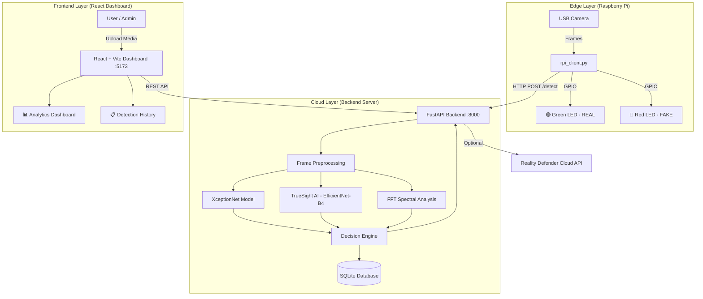

<p align="center">
  <h1 align="center">🛡️ Pinnacle 6 — Deepfake Detection System</h1>
  <p align="center">
    <b>An end-to-end Hybrid Edge-Cloud platform for detecting face-swap deepfakes across images, video, and audio using Deep Learning, Spectral Analysis, and IoT hardware.</b>
  </p>
  <p align="center">
    
    
    
    
    
    
    
  </p>
</p>

---

## 📌 Table of Contents

- [About the Project](#-about-the-project)
- [Problem Statement](#-problem-statement)
- [Our Solution](#-our-solution)
- [System Architecture](#-system-architecture)
- [Tech Stack](#-tech-stack)
- [AI Models & Detection Logic](#-ai-models--detection-logic)
- [Mathematical Model](#-mathematical-model)
- [Frontend — Web Dashboard](#-frontend--web-dashboard)
- [Backend — API Server](#-backend--api-server)
- [Hardware — Edge Device (Raspberry Pi)](#-hardware--edge-device-raspberry-pi)
- [Database](#-database)
- [Project Structure](#-project-structure)
- [Getting Started](#-getting-started)
- [API Reference](#-api-reference)
- [Deployment Guide](#-deployment-guide)
- [Team](#-team)
- [Future Scope](#-future-scope)
- [License](#-license)

---

## 🔍 About the Project

**Pinnacle 6** is a full-stack deepfake detection platform built to combat the growing threat of AI-generated synthetic media. The system is designed to analyze **images, videos, and audio files** to determine whether the content is authentic or has been synthetically manipulated using techniques like face-swapping, GAN-based generation, or voice cloning.

The platform operates on a **Hybrid Edge-Cloud architecture**, combining:
- A powerful **cloud-based backend** running deep learning models for heavy inference.
- A lightweight **edge client** (Raspberry Pi) for real-time video acquisition and immediate physical feedback via LED indicators.
- A modern, interactive **web dashboard** for user-friendly media upload, analysis, and history review.

> **Key Innovation**: Unlike most deepfake detectors that work only in the cloud, Pinnacle 6 brings real-time detection to physical security checkpoints through IoT edge devices while maintaining the accuracy of cloud-based deep learning.

---

## ❗ Problem Statement

The rapid advancement of Generative AI (GANs, Diffusion models, etc.) has made it trivially easy to create highly realistic fake images, videos, and audio clips — commonly known as **deepfakes**. These pose serious threats:

- **Misinformation & Fake News** — fabricated videos of public figures used to spread false narratives.
- **Identity Theft & Fraud** — deepfake voice/video calls used for financial fraud and impersonation.
- **Cyberbullying & Non-consensual Content** — creation of fake intimate media without consent.
- **National Security** — manipulated intelligence or political propaganda.

There is an urgent need for automated, real-time, and accessible tools to detect such synthetic content before it causes harm.

---

## 💡 Our Solution

Pinnacle 6 provides a **multi-modal deepfake detection system** with three key pillars:

| Pillar | Description |
|---|---|
| 🧠 **AI-Powered Detection** | Dual-model architecture using XceptionNet (TensorFlow) and EfficientNet-B4 (PyTorch) for high-accuracy classification, plus FFT-based spectral analysis and temporal consistency checks. |
| ☁️ **Cloud + Edge Hybrid** | Heavy ML inference runs on a scalable cloud backend (FastAPI), while a lightweight Raspberry Pi edge client provides real-time camera surveillance with physical LED feedback. |
| 🖥️ **Interactive Web Dashboard** | A polished React + Tailwind CSS dashboard for media upload (image/video/audio), real-time results with confidence visualization, detection history, analytics, and user management. |

---

## 🏗️ System Architecture



### Data Flow

1. **Input Acquisition**
   - **Web Mode**: User uploads an image, video, or audio file via the React dashboard.
   - **Edge Mode**: Raspberry Pi captures frames from a USB webcam every 2 seconds.

2. **Transmission**
   - Media is sent as `multipart/form-data` to the backend's `/detect` or `/ai-detect` endpoint.
   - Requests are authenticated via JWT Bearer tokens (or guest mode for demos).

3. **Processing & Inference**
   - **Image**: Face region extracted (Haar Cascade) → Normalized → Fed to XceptionNet or EfficientNet-B4 → FFT spectral analysis for high-frequency artifact detection.
   - **Video**: Frames sampled at intervals → Each frame processed individually → Temporal average pooling for video-level consensus → Inter-frame variance analysis for flicker detection.
   - **Audio**: Processed via the Audio Deepfake API or deterministic hash-based fallback.

4. **Output & Feedback**
   - Returns JSON with: `label` (REAL/FAKE/INCONCLUSIVE), `confidence` (0–100%), `confidence_band`, `synthetic_likelihood`, `human_likelihood`, detailed `reasons`, and more.
   - **Web**: Dashboard displays verdict with animated confidence gauges and detailed breakdown.
   - **Edge**: Red LED lights for FAKE, Green LED for REAL — immediate physical feedback.

---

## 🛠️ Tech Stack

### Backend
| Technology | Purpose |
|---|---|
| **Python 3.9+** | Core backend language |
| **FastAPI** | High-performance async REST API framework |
| **Uvicorn** | ASGI server for running FastAPI |
| **PyTorch 2.x** | TrueSight AI model (EfficientNet-B4) inference |
| **TensorFlow 2.x** | XceptionNet model training and inference |
| **OpenCV** | Image/video processing, face detection (Haar Cascade) |
| **NumPy** | Numerical operations, FFT spectral analysis |
| **SQLite** | Lightweight database for detection history |
| **PassLib + python-jose** | Password hashing (PBKDF2-SHA256) and JWT authentication |
| **Reality Defender SDK** | Optional cloud-based deepfake detection API |
| **python-dotenv** | Environment variable management |

### Frontend
| Technology | Purpose |
|---|---|
| **React 18** | Component-based UI framework |
| **Vite** | Lightning-fast build tool and dev server |
| **Tailwind CSS 3** | Utility-first CSS framework for styling |
| **Framer Motion** | Smooth page transitions and micro-animations |
| **Recharts** | Data visualization for detection analytics |
| **Lucide React** | Modern icon library |
| **Axios** | HTTP client for API communication |
| **React Router DOM 7** | Client-side routing and navigation |
| **Spline (3D)** | Interactive 3D elements for the landing page |
| **tsParticles** | Animated particle backgrounds |

### Hardware / IoT
| Technology | Purpose |
|---|---|
| **Raspberry Pi 4 Model B** | Edge computing device |
| **USB Webcam** | Video input source |
| **RPi.GPIO** | GPIO pin control for LED feedback |
| **Green & Red LEDs** | Physical REAL/FAKE indicators |

---

## 🧠 AI Models & Detection Logic

### Model 1: XceptionNet (Primary — TensorFlow)

**XceptionNet** (Extreme Inception) is a deep convolutional neural network specifically chosen for deepfake detection because of its superior ability to capture **mesoscopic-level artifacts** — subtle pixel-level irregularities invisible to the human eye but present in deepfakes:

- **Face Boundary Artifacts** — inconsistencies where the swapped face meets the original background.
- **Compression Artifacts** — unique noise footprints left by GAN-based generation.
- **Inconsistent Illumination** — lighting direction mismatches between the face and the scene.

**Pipeline**:
1. Frame extraction from video (or direct image input).
2. Face detection using **Haar Cascade Classifier** for ROI (Region of Interest) extraction.
3. Image resized to **299×299** pixels; pixel normalization to [-1, 1].
4. Forward pass through XceptionNet → outputs probability score (0.0 to 1.0).
5. Score > 0.5 → **FAKE**, ≤ 0.5 → **REAL**.

### Model 2: TrueSight AI — EfficientNet-B4 (PyTorch)

A fine-tuned **EfficientNet-B4** model trained specifically for deepfake detection with a custom classifier head:

```
BatchNorm1d(1792)  →  Dropout(0.5)  →  Linear(1792, 256)  →  ReLU  →  Dropout(0.5)  →  Linear(256, 1)
```

- Input: **380×380** pixel RGB images, normalized with ImageNet statistics.
- Output: Sigmoid probability → classification against a learned threshold of **0.70**.
- The model runs on CPU for broad deployment compatibility.
- State-dict is verified on load (key/shape validation + smoke test).

### Supplementary Techniques

| Technique | Purpose |
|---|---|
| **FFT Spectral Analysis** | Detects anomalous high-frequency patterns in the frequency domain that deepfakes exhibit. Uses 2D Fast Fourier Transform with high-frequency energy measurement. |
| **Temporal Consistency Analysis** | For videos — measures inter-frame prediction variance to detect flickering artifacts common in deepfakes. |
| **Confidence Calibration** | Temperature scaling applied to logits before sigmoid activation for well-calibrated output probabilities. |
| **Reality Defender Cloud API** | Optional integration with Reality Defender's commercial deepfake detection service as a primary detection path (with local fallback). |

### Demo / Fallback Mode

When the trained model weights file is unavailable, the system operates in **Deterministic Simulation Mode**:
- Uses FFT-based spectral energy analysis as a heuristic.
- Produces consistent, repeatable results for the same input.
- Allows full end-to-end testing of the UI, API, hardware indicators, and data pipeline without the heavy ML model.

---

## 📐 Mathematical Model

The system's inference logic is grounded in the following mathematical formulations:

### 1. Discrete Video Frame Sampling
$$V = \{f_1, f_2, \dots, f_T\} \quad \text{where} \quad f_t = \mathcal{V}(t \cdot \Delta t)$$

### 2. Region of Interest (ROI) Extraction
$$x_t = \text{Crop}(f_t, \mathcal{D}(f_t))$$

### 3. Image Normalization (Min–Max Scaling)
$$\hat{x}_t^{(i,j)} = \frac{x_t^{(i,j)} - \min(x_t)}{\max(x_t) - \min(x_t)}$$

### 4. Deep Feature Embedding
$$z_t = \Phi(\hat{x}_t; \theta_{CNN}) \in \mathbb{R}^D$$

### 5. Logistic Regression (Sigmoid Activation)
$$P(\text{Fake} | x_t) = \sigma(w^T z_t + b) = \frac{1}{1 + e^{-(w^T z_t + b)}}$$

### 6. Temporal Average Pooling (Video-Level)
$$\bar{y} = \frac{1}{T} \sum_{t=1}^T P(\text{Fake} | x_t)$$

### 7. Binary Decision Thresholding
$$C = \begin{cases} 1 \; (\text{FAKE}) & \text{if } \bar{y} > \tau \\ 0 \; (\text{REAL}) & \text{otherwise} \end{cases}$$

### 8. Binary Cross-Entropy Loss (Training)
$$\mathcal{L}(\theta) = -\frac{1}{N} \sum_{i=1}^N \left[ y_i \log(\hat{y}_i) + (1 - y_i) \log(1 - \hat{y}_i) \right]$$

### 9. Inter-Frame Prediction Variance
$$\sigma^2_{\text{temp}} = \frac{1}{T} \sum_{t=1}^T (\hat{y}_t - \bar{y})^2$$

### 10. High-Frequency Spectral Energy (FFT)
$$E_{\text{high}} = \sum_{u,v \in \Omega_{HF}} | \mathcal{F}(x_t)[u,v] |^2$$

### 11. Confidence Calibration (Temperature Scaling)
$$\hat{q}_t = \sigma\left( \frac{z_{\text{logits}}}{T_s} \right)$$

---

## 🖥️ Frontend — Web Dashboard

The frontend is a **React 18** single-page application built with **Vite** and styled using **Tailwind CSS**, delivering a modern, responsive, and visually rich user experience.

### Pages & Features

| Page | Description |
|---|---|
| **Home (Landing)** | Hero section with animated 3D elements (Spline), particle backgrounds, feature highlights, and call-to-action. |
| **Detector** | Core tool — drag-and-drop or click-to-upload media files (images, videos, audio). Displays real-time analysis results with confidence gauges, synthetic vs. human likelihood bars, and detailed reasoning. Supports both the Mathematical Model (`/detect`) and TrueSight AI (`/ai-detect`) engines. |
| **Detection History** | Paginated, filterable list of all past scans with media type badges, confidence indicators, result labels, and timestamps. Supports clearing history. |
| **Dashboard / Stats** | Analytics overview with total scans, media type breakdowns (image/video/audio), real vs. fake distribution, average confidence metrics — powered by Recharts data visualizations. |
| **Login / Register** | JWT-based authentication with clean, animated forms. Guest mode available for demo usage. |
| **API Documentation** | Interactive API reference page documenting all endpoints. |
| **Privacy Policy / Terms of Service** | Legal compliance pages. |
| **System Status** | Real-time backend health check and AI model status page. |

### UI Highlights
- 🎨 **Glassmorphism & Gradients** — Modern glass-effect cards with vivid gradient accents.
- ✨ **Framer Motion Animations** — Smooth page transitions, staggered list animations, and hover micro-interactions.
- 🌐 **3D Interactive Elements** — Spline-powered 3D visuals on the landing page.
- 🔤 **Modern Typography** — Clean, high-contrast font stack with Tailwind's default sans-serif.
- 📱 **Fully Responsive** — Optimized for desktop, tablet, and mobile viewports.

---

## ⚙️ Backend — API Server

The backend is a **FastAPI** application that serves as the central nervous system of the platform.

### Core Responsibilities

| Area | Details |
|---|---|
| **Media Analysis** | Processes uploaded images, videos, and audio files through the AI detection pipeline. |
| **Authentication** | JWT-based auth with registration, login, and protected endpoints. PBKDF2-SHA256 password hashing via PassLib. |
| **Database Management** | SQLite database for storing detection records, user accounts, and aggregated statistics. |
| **Model Management** | Loads and caches both XceptionNet (TensorFlow) and EfficientNet-B4 (PyTorch) models at startup as singletons. |
| **Cloud API Integration** | Optional Reality Defender API integration with graceful fallback to local models. |
| **Logging & Diagnostics** | Comprehensive logging, diagnostic scripts, and health check endpoints. |

### Key Endpoints

| Method | Endpoint | Description |
|---|---|---|
| `POST` | `/detect` | Analyze media using the Mathematical Model (XceptionNet + FFT) |
| `POST` | `/ai-detect` | Analyze images using TrueSight AI (EfficientNet-B4) |
| `GET` | `/ai-status` | Check if the TrueSight AI model is loaded |
| `POST` | `/register` | Create a new user account |
| `POST` | `/login` | Authenticate and receive JWT token |
| `GET` | `/users/me` | Get current authenticated user info |
| `GET` | `/stats/summary` | Get aggregated detection statistics |
| `GET` | `/detections/history` | Retrieve detection history (filterable by media type) |
| `DELETE` | `/detections/history` | Soft-delete detection history for the user |
| `GET` | `/health` | Backend health check |

---

## 🔌 Hardware — Edge Device (Raspberry Pi)

The edge component enables **real-time physical surveillance** by connecting a Raspberry Pi to the cloud backend.

### Components Required
- Raspberry Pi 4 Model B
- USB Webcam
- 1× Green LED (REAL indicator)
- 1× Red LED (FAKE indicator)
- 2× 220Ω Resistors
- Breadboard & Jumper Wires

### Wiring

| Component | Connection |
|---|---|
| Green LED Anode | GPIO 18 (Physical Pin 12) |
| Red LED Anode | GPIO 23 (Physical Pin 16) |
| LED Cathodes | Through 220Ω resistor to GND |
| USB Webcam | Any USB port |

### Operation
1. The Raspberry Pi captures a frame from the webcam every **2 seconds**.
2. The frame is JPEG-encoded and sent to the backend's `/detect` endpoint via HTTP POST.
3. Based on the response:
   - 🟢 **Green LED** lights up → Content is **REAL**
   - 🔴 **Red LED** lights up → Content is **FAKE**
4. The cycle repeats continuously until interrupted.

---

## 🗄️ Database

**SQLite** is used for lightweight, zero-configuration data persistence.

### Tables

**`detections`** — Stores every scan result.

| Column | Type | Description |
|---|---|---|
| `id` | INTEGER (PK) | Auto-incrementing primary key |
| `file_name` | TEXT | Name of the uploaded file |
| `media_type` | TEXT | `image`, `video`, `audio`, or `live` |
| `source` | TEXT | `web` or `edge` |
| `result_label` | TEXT | `REAL`, `FAKE`, or `INCONCLUSIVE` |
| `confidence` | REAL | Confidence percentage (0–100) |
| `confidence_band` | TEXT | `High`, `Medium`, or `Low` |
| `synthetic_likelihood` | REAL | Probability of being synthetic (%) |
| `human_likelihood` | REAL | Probability of being authentic (%) |
| `frames_analyzed` | INTEGER | Number of frames processed (videos) |
| `faces_detected` | INTEGER | Number of faces found |
| `audio_duration` | REAL | Duration of audio (seconds) |
| `user_id` | INTEGER (FK) | References `users.id` |
| `is_hidden` | BOOLEAN | Soft-delete flag |
| `created_at` | TIMESTAMP | Record creation time |

**`users`** — User accounts for authentication.

| Column | Type | Description |
|---|---|---|
| `id` | INTEGER (PK) | Auto-incrementing primary key |
| `username` | TEXT (UNIQUE) | User's chosen username |
| `password_hash` | TEXT | PBKDF2-SHA256 hashed password |
| `created_at` | TIMESTAMP | Account creation time |

---

## 📁 Project Structure

```
pinnacle6/
├── backend/
│   ├── main.py                 # FastAPI application (routes, auth, startup)
│   ├── model.py                # Detection logic (XceptionNet, FFT, video/image/audio pipelines)
│   ├── database.py             # SQLite database operations (CRUD, stats)
│   ├── requirements.txt        # Python dependencies
│   ├── ai_model/               # TrueSight AI module
│   │   ├── __init__.py         # Package exports
│   │   ├── model_loader.py     # EfficientNet-B4 architecture builder & weight loader
│   │   ├── inference.py        # Image preprocessing & inference pipeline
│   │   └── models/             # Pre-trained model weights (.pth)
│   └── detections.db           # SQLite database file
│
├── frontend/
│   ├── package.json            # Node.js dependencies & scripts
│   ├── index.html              # HTML entry point
│   ├── tailwind.config.js      # Tailwind CSS configuration
│   ├── postcss.config.js       # PostCSS configuration
│   └── src/
│       ├── App.jsx             # Root component with routing
│       ├── main.tsx            # React entry point
│       ├── index.css           # Global Tailwind CSS imports
│       ├── context/
│       │   └── AuthContext.jsx  # JWT auth context provider
│       ├── lib/                # Utility functions
│       └── components/
│           ├── Home.jsx        # Landing page with 3D elements
│           ├── Detector.jsx    # Media upload & analysis tool
│           ├── DetectionHistory.jsx  # Past scan results
│           ├── DashboardStats.jsx   # Analytics dashboard
│           ├── Login.jsx       # Login form
│           ├── Register.jsx    # Registration form
│           ├── Navbar.jsx      # Navigation bar
│           ├── Status.jsx      # System status checker
│           ├── ApiDocs.jsx     # API documentation page
│           ├── PrivacyPolicy.jsx    # Privacy page
│           ├── TermsOfService.jsx   # Terms page
│           └── ProtectedRoute.jsx   # Auth route guard
│
├── hardware/
│   ├── rpi_client.py           # Raspberry Pi edge detection client
│   └── wiring.md              # Hardware wiring instructions
│
├── docs/
│   ├── architecture.md         # System architecture documentation
│   ├── mathematical_model.md   # Mathematical model equations
│   ├── detection_logic.md      # Detection algorithms explained
│   └── deployment.md           # Cloud deployment guide
│
├── setup_and_run.bat           # Windows one-click setup script
├── cleanup_and_start.bat       # Windows cleanup & restart script
└── README.md                   # This file
```

---

## 🚀 Getting Started

### Prerequisites

- **Python 3.9+** — [Download](https://www.python.org/downloads/)
- **Node.js 18+** — [Download](https://nodejs.org/)
- **Git** — [Download](https://git-scm.com/)

### 1. Clone the Repository

```bash
git clone https://github.com/<your-username>/pinnacle6.git
cd pinnacle6
```

### 2. Backend Setup

```bash
cd backend

# Create virtual environment
python -m venv venv

# Activate virtual environment
# Windows:
venv\Scripts\activate
# Linux/macOS:
source venv/bin/activate

# Install dependencies
pip install -r requirements.txt

# (Optional) Configure environment variables
# Create a .env file with:
#   REALITY_DEFENDER_API_KEY=your_key_here
#   AUDIO_DEEPFAKE_API_KEY=your_key_here
#   MODEL_PATH=deepfake_xception.h5

# Start the server
python main.py
# Server runs at http://localhost:8000
```

### 3. Frontend Setup

```bash
cd frontend

# Install dependencies
npm install

# Start development server
npm run dev
# Dashboard available at http://localhost:5173
```

### 4. Hardware Setup (Raspberry Pi — Optional)

1. Connect components as per `hardware/wiring.md`.
2. Update `<YOUR_LAPTOP_IP>` in `rpi_client.py` with the backend server's IP address.
3. Run:

```bash
python3 hardware/rpi_client.py
```

### Windows Quick Start

Use the included batch scripts for one-click setup:

```bash
# First-time setup
setup_and_run.bat

# Subsequent runs
cleanup_and_start.bat
```

---

## 📡 API Reference

The backend exposes a RESTful API. Interactive documentation is available at:
- **Swagger UI**: `http://localhost:8000/docs`
- **ReDoc**: `http://localhost:8000/redoc`

### Example: Detect Deepfake (Image)

```bash
curl -X POST http://localhost:8000/detect \
  -F "file=@test_image.jpg" \
  -H "Authorization: Bearer <your_jwt_token>"
```

**Response:**
```json
{
  "label": "FAKE",
  "confidence": 87.32,
  "confidence_band": "High",
  "message": "Local Analysis: Score=0.87",
  "variance": 0.0,
  "fft_energy": 0.0,
  "reasons": ["Processed locally"],
  "synthetic_likelihood": 87.32,
  "human_likelihood": 12.68
}
```

### Example: TrueSight AI Detection

```bash
curl -X POST http://localhost:8000/ai-detect \
  -F "file=@test_image.jpg" \
  -H "Authorization: Bearer <your_jwt_token>"
```

---

## ☁️ Deployment Guide

### Backend (AWS EC2 / Any Linux Server)

1. Launch an Ubuntu 22.04 instance (t3.medium or higher).
2. Open port **8000** in the security group.
3. Setup:
```bash
sudo apt update && sudo apt install python3-pip python3-venv libgl1
git clone <REPO_URL>
cd pinnacle6/backend
python3 -m venv venv && source venv/bin/activate
pip install -r requirements.txt
nohup uvicorn main:app --host 0.0.0.0 --port 8000 &
```

### Frontend (Vercel / Netlify)

1. Build the production bundle:
```bash
cd frontend
npm run build
```
2. Deploy the `dist/` folder to **Netlify** (drag-and-drop) or connect the GitHub repo to **Vercel**.

### Docker (Optional)

```dockerfile
# Backend
FROM python:3.11-slim
WORKDIR /app
COPY backend/ .
RUN pip install -r requirements.txt
CMD ["uvicorn", "main:app", "--host", "0.0.0.0", "--port", "8000"]
```

---

## 👥 Team

**Team Pinnacle 6**

> *Built with ❤️ for combating synthetic media misinformation.*

---

## 🔮 Future Scope

- 🎯 **Enhanced Model Training** — Fine-tune on larger, more diverse deepfake datasets (FaceForensics++, Celeb-DF, WildDeepfake) for improved generalization.
- 🎙️ **Advanced Audio Detection** — Integrate specialized voice-cloning detection models beyond API-based solutions.
- 📹 **Real-time Video Streaming** — WebSocket-based live video analysis for continuous monitoring.
- 🐳 **Docker & Kubernetes** — Containerized deployment with horizontal auto-scaling.
- 📊 **Advanced Analytics** — Trend analysis, detection heatmaps, and exportable reports.
- 🔐 **Multi-Factor Authentication** — Enhanced security with 2FA/MFA support.
- 📱 **Mobile App** — React Native companion app for on-the-go detection.
- 🌍 **Multi-Language Support** — Internationalization (i18n) for global accessibility.
- 🤖 **Explainable AI (XAI)** — GradCAM / attention map overlays showing which regions triggered the FAKE verdict.

---

## 📄 License

This project is developed for academic and research purposes.

---

<p align="center">
  <b>⭐ If you found this project useful, please give it a star on GitHub!</b>
</p>
