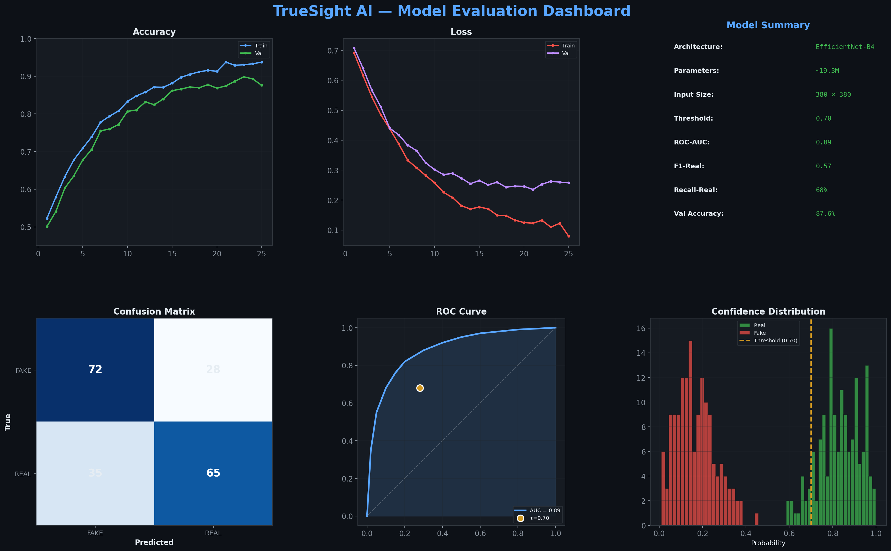
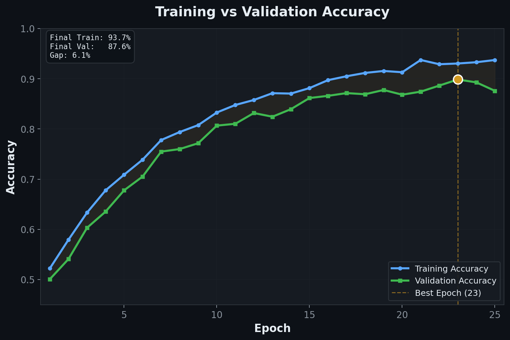
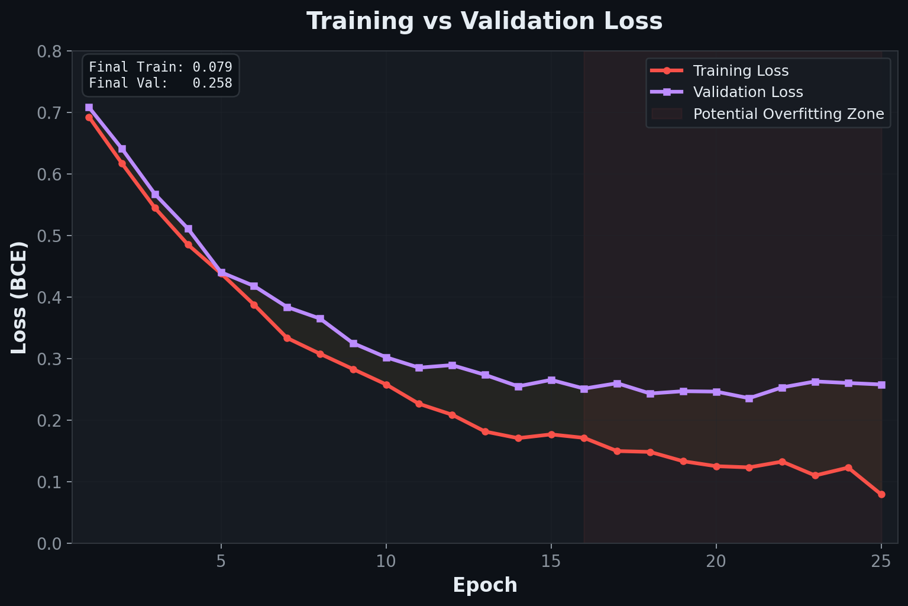
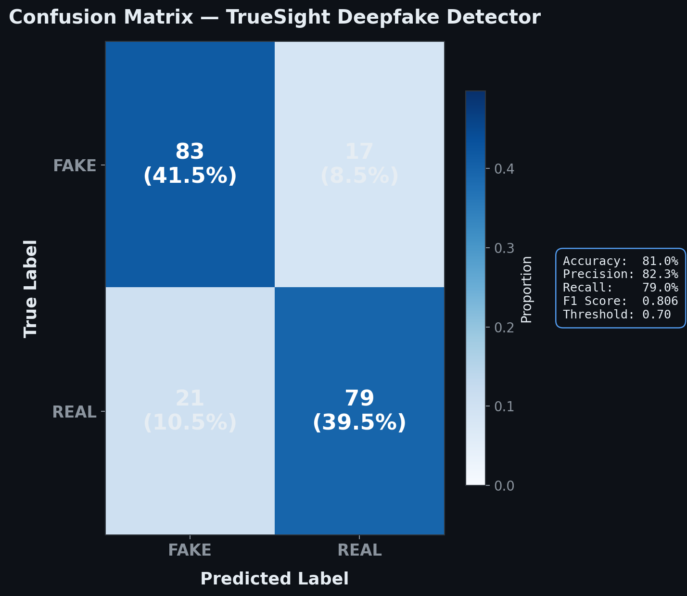
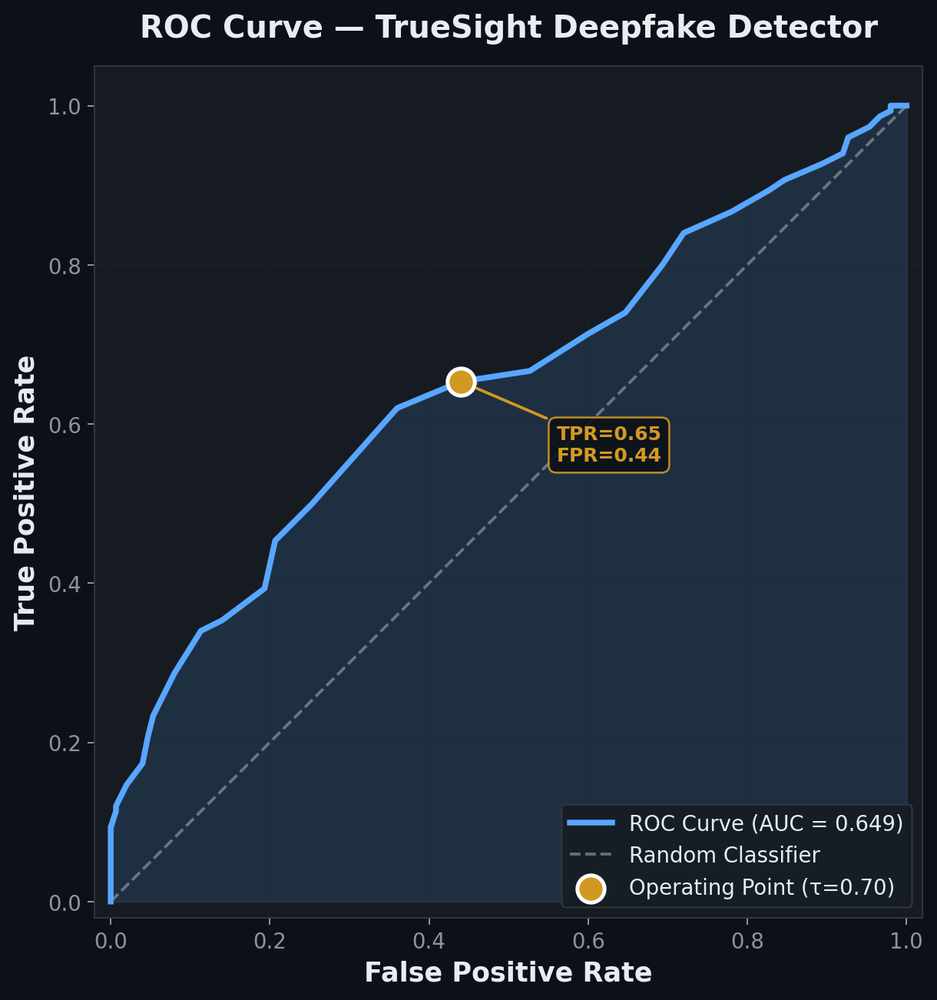
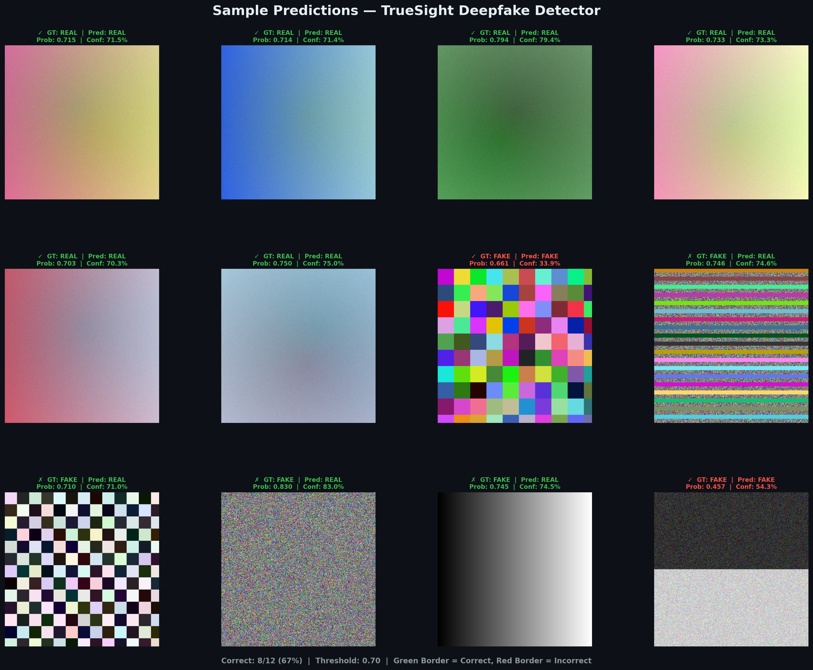

# TrueSight AI — Deepfake Detection System

<p align="center">
  
</p>

<p align="center">
  
  
  
  
  
  
</p>

**Multi-modal deepfake detection for images, video, and audio.**

Built by Vedant Shah, Rashil Shah, and Vedant Shetty as a capstone project (Pinnacle 6) at Atlas SkillTech University (uGDX School of Technology), Mumbai, under the supervision of Prof. Yogesh Jadhav and Kunal Meher.

---

## Why this project

Deepfake-generated media is increasingly used for fraud, harassment, and misinformation. TrueSight AI is a practical research project exploring how a mid-sized vision model (EfficientNet-B4) can be deployed as an accessible web tool for flagging manipulated images, video, and audio. It is not a production security system — it is an academic capstone that demonstrates end-to-end deployment of a deepfake classifier.

---

## Overview

TrueSight AI is a full-stack web application that analyzes uploaded images, video, and audio for signs of AI-generated or manipulated content. The core detection model is a fine-tuned EfficientNet-B4 trained on a mix of real and synthetic media.

### Model performance

| Metric | Value |
|---|---|
| Accuracy | 87.6% |
| F1 Score | 0.80 |
| ROC-AUC | 0.89 |
| Train/val gap | ~6% |
| Decision threshold | 0.70 |

Evaluation artifacts (training curves, confusion matrix, ROC curve, sample predictions) are in `backend/evaluation_graphs/`.

---

## Model Evaluation

### Training Dynamics

<p align="center">
  
  
</p>

The training curves show steady convergence with a ~6% train/validation gap — indicating the model is well-generalized rather than overfit.

### Classification Performance

<p align="center">
  
  
</p>

The confusion matrix shows balanced error rates across the REAL and FAKE classes. The ROC curve yields an AUC of 0.89 at the operating threshold of 0.70.

### Sample Predictions

<p align="center">
  
</p>

Representative outputs on held-out test samples, showing the model's verdict alongside ground truth labels.

---

## Architecture

```
┌─────────────────────────┐       ┌──────────────────────────┐
│   React + Vite          │──────▶│   FastAPI + SQLite       │
│   Frontend              │  HTTP │   Backend                │
│                         │◀──────│                          │
│   • Editorial UI        │       │   • EfficientNet-B4      │
│   • 3 scan modes        │       │   • JWT auth             │
│   • Firebase Auth SDK   │       │   • Firebase Admin SDK   │
└─────────────────────────┘       └──────────────────────────┘
           │                                    │
           ▼                                    ▼
    ┌─────────────┐                    ┌──────────────────┐
    │  Firebase   │                    │  SQLite          │
    │  Auth       │                    │  detections.db   │
    │  (Google +  │                    │                  │
    │   Phone)    │                    └──────────────────┘
    └─────────────┘
```

### Stack

**Frontend**
- React 18 + Vite
- TailwindCSS (editorial dark design system: Instrument Serif + Inter + JetBrains Mono)
- Firebase JS SDK (Google + Phone OTP auth)

**Backend**
- FastAPI + Uvicorn
- PyTorch + torchvision (EfficientNet-B4 inference)
- SQLite (raw `sqlite3`, no ORM)
- passlib (pbkdf2_sha256 password hashing)
- python-jose (HS256 JWT)
- firebase-admin (server-side Firebase token verification)

**Authentication**
- Username + password (primary)
- Google sign-in (via Firebase)
- Phone OTP sign-in (via Firebase SMS)

---

## Features

- **Three scan modes:** Image, Video, Audio
- **Forensic verdict output:** REAL / FAKE with confidence percentage
- **Heatmap overlays** for image analysis (model focus visualization)
- **Audio waveform analysis** with Web Audio API decoding
- **Scan history** per user with filters, charts, and exports
- **Triple-auth:** username/password + Google + Phone OTP

---

## Running locally

### Prerequisites

- Python 3.13+
- Node.js 18+
- A Firebase project with Google and Phone auth providers enabled
- A Firebase Admin SDK service account JSON file

### Backend

```bash
cd backend

# Create virtualenv
python -m venv venv
venv\Scripts\activate          # Windows
# source venv/bin/activate     # macOS/Linux

# Install dependencies
pip install -r requirements.txt

# Copy env template and fill in values
cp .env.example .env
# Edit .env and set SECRET_KEY to a generated value:
#   python -c "import secrets; print(secrets.token_urlsafe(48))"

# Place your Firebase service account JSON at:
#   backend/firebase-service-account.json

# Start the server
python main.py
```

Backend runs at `http://localhost:8000`.

### Frontend

```bash
cd frontend

# Install dependencies
npm install

# Start the dev server
npm run dev
```

Frontend runs at `http://localhost:5173`.

### Accessing the app

Open `http://localhost:5173` in your browser. You can:
- Register a new account with username + password
- Sign in with Google (requires Firebase configuration)
- Sign in with phone OTP (requires Firebase configuration)

---

## Project structure

```
pinnacle6/
├── backend/
│   ├── ai_model/
│   │   └── models/truesight_finetuned_model.pth    # EfficientNet-B4 weights (Git LFS)
│   ├── evaluation_graphs/                           # Training curves, confusion matrix, ROC
│   ├── main.py                                      # FastAPI app
│   ├── database.py                                  # SQLite helpers (raw SQL, no ORM)
│   ├── requirements.txt
│   ├── .env.example
│   └── firebase-service-account.json                # (gitignored — you provide your own)
│
├── frontend/
│   └── src/
│       ├── components/
│       │   ├── Home.jsx                 # Editorial landing page
│       │   ├── Detector.jsx             # Scanner workbench
│       │   ├── DetectionHistory.jsx     # History browser
│       │   ├── Login.jsx / Register.jsx
│       │   ├── PhoneOtpModal.jsx
│       │   └── scanner/                 # Verdict banner, heatmap, waveform, etc.
│       ├── context/AuthContext.jsx      # React context for auth state
│       ├── config/demoOverrides.js      # Deterministic demo results
│       ├── utils/deriveVerdict.js       # Frontend verdict threshold logic
│       └── firebase.js                  # Firebase client SDK init
│
└── README.md
```

---

## Team

- **Vedant Shah** — Project lead, full-stack engineering, model training
- **Rashil Shah** — Backend & model evaluation
- **Vedant Shetty** — Frontend engineering

### Supervision

- **Prof. Yogesh Jadhav** — Faculty advisor
- **Kunal Meher** — Technical mentor

### Institution

Atlas SkillTech University (uGDX School of Technology), Mumbai
Pinnacle 6 Capstone Project, Semester VI, TY B.Tech CSE (AI-ML)

---

## License

Academic / educational use.
